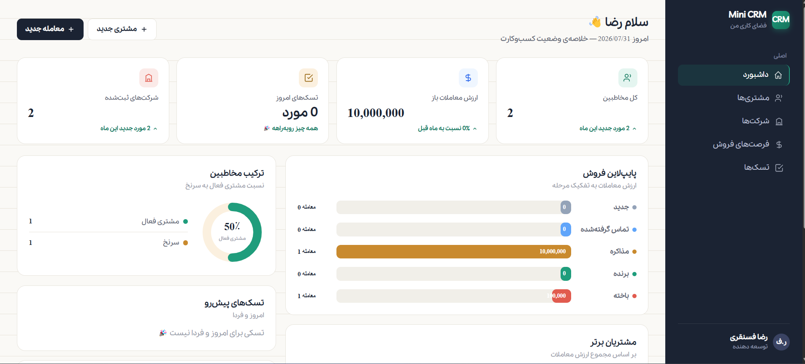
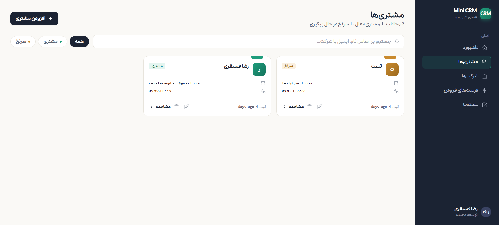
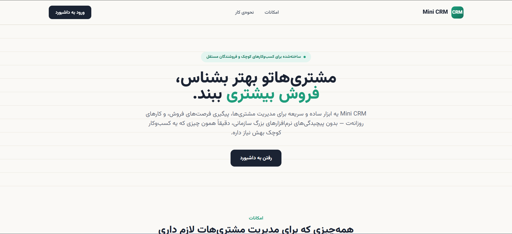
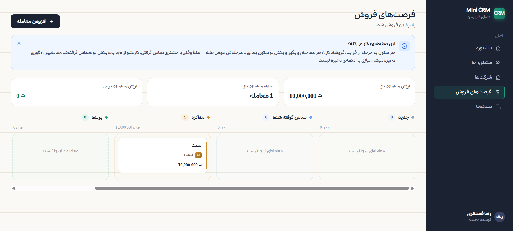

<div align="center">

# 🚀 Mini CRM

### A modern Customer Relationship Management (CRM) application built with Laravel 13.

<p>
  
  
  
  
  
  
</p>

*A clean, fast and secure CRM system designed to help businesses manage customers, companies, sales opportunities and daily tasks.*

</div>

---

# ✨ Overview

Mini CRM is a modern CRM application developed with **Laravel 13**, focusing on simplicity, performance, and a great user experience.

The project enables businesses to organize customer information, manage companies, track sales opportunities through a visual sales pipeline, and stay productive with an integrated task management system.

This project was built as a portfolio project to demonstrate modern Laravel development practices and clean architecture.

---

# 📸 Screenshots

| Dashboard | Customers |
|-----------|-----------|
|  |  |

| index                                   | Sales Pipeline |
|-----------------------------------------|----------------|
|  |  |


# 🌟 Features

## 🔐 Authentication

- Secure Login
- User Registration
- Profile Management
- Protected Routes

---

## 👥 Customer Management

- Create Customers
- Edit Customers
- Delete Customers
- Search Customers
- Customer Status
- Company Assignment

---

## 🏢 Company Management

- Create Companies
- Edit Companies
- Delete Companies
- Company Information
- Customer Relations

---

## 💰 Sales Opportunity Management

Manage your entire sales process using a visual pipeline.

Pipeline Stages

- 🆕 New
- 📞 Contacted
- 🤝 Negotiation
- 🏆 Won
- ❌ Lost

Each opportunity contains:

- Estimated Value
- Expected Close Date
- Customer
- Company
- Stage
- Notes

---

## ✅ Task Management

- Create Tasks
- Edit Tasks
- Mark as Completed
- Due Dates
- Upcoming Tasks

---

## 📊 Dashboard Analytics

The dashboard provides useful business insights including:

- Total Customers
- Registered Companies
- Open Deal Value
- Sales Pipeline
- Top Customers
- Contact Ratio
- Upcoming Tasks
- Recent Activities

---

## 🔍 Search

Global searching is available across:

- Customers
- Companies
- Opportunities
- Tasks

---

## 🔒 Data Security

Each authenticated user can only access their own data.

User data isolation prevents unauthorized access to other users' records.

---

# 🛠 Tech Stack

| Technology | Version |
|------------|----------|
| Laravel | 13 |
| Livewire | 3 |
| Tailwind CSS | 4 |
| PHP | 8.4 |
| MySQL | Latest |
| Alpine.js | Included |
| Laravel Breeze | Authentication |
| Vite | Asset Bundler |

---

# 🏗 Architecture

The project follows Laravel best practices and clean architecture.

### Relationships

```
User
 ├── Companies
 ├── Customers
 ├── Opportunities
 └── Tasks

Company
 └── Customers

Customer
 ├── Opportunities
 └── Tasks

Opportunity
 └── Tasks
```

---

# ⚙ Laravel Features Used

- Form Requests
- Eloquent Relationships
- Route Model Binding
- Pagination
- Model Scopes
- Authentication
- Validation
- Resource Controllers
- Middleware
- Policies

---

# 📂 Project Structure

```
app/
 ├── Models
 ├── Livewire
 ├── Http
 ├── Providers
 └── Policies

resources/
 ├── views
 ├── css
 └── js

routes/

database/

public/

storage/
```

---

# 🚀 Installation

Clone the repository

```bash
git clone https://github.com/rezaFesanghari/mini-crm.git
```

Move into the project

```bash
cd mini-crm
```

Install dependencies

```bash
composer install
```

Copy environment file

```bash
cp .env.example .env
```

Generate application key

```bash
php artisan key:generate
```

Configure your database inside `.env`

Run migrations

```bash
php artisan migrate
```

Install frontend packages

```bash
npm install
```

Build assets

```bash
npm run build
```

Run the application

```bash
php artisan serve
```

---

# 📊 Dashboard Preview

The dashboard includes:

- Customer Statistics
- Registered Companies
- Open Deal Value
- Sales Pipeline
- Top Customers
- Customer Ratio
- Upcoming Tasks
- Recent Activities

---

# 🔒 Security

Mini CRM follows Laravel security best practices.

- Authentication
- Authorization
- CSRF Protection
- Validation
- Route Protection
- User Data Isolation
- Secure Eloquent Queries

---

# 📈 Future Improvements

- Notifications
- Calendar Integration
- Email Integration
- REST API
- File Attachments
- Activity Logs
- Team Collaboration
- Reports & Analytics
- Dark Mode

---

# 🤝 Contributing

Contributions, issues and feature requests are welcome.

Feel free to fork this repository and submit a pull request.

---

# 👨‍💻 Author

**Reza Fesanghari**

🌐 Portfolio

https://rscode.ir

💻 GitHub

https://github.com/rezaFesanghari

---

# ⭐ Support

If you like this project, consider giving it a ⭐ on GitHub.

It helps others discover the project and motivates future improvements.

---

<div align="center">

## Thank you for visiting ❤️

Made with Laravel 13 & Livewire.

</div>
